# Battle Simulation System

The **Battle Simulation System** is a professional, enterprise-grade Java application refactored from a basic One Piece battle system. The codebase has been redesigned to showcase clean code principles, modular service-oriented architecture, SOLID principles, robust exception handling, generic collections, file I/O persistence, and strict unit testing.

---

## 1. Project Overview
The Battle Simulation System allows users to register, manage, and group characters (Captains, Swordsmen, Navigators, and Devil Fruit Users) into crews, validate their statistics, simulate turn-based battles with randomized attack damage and critical hits, and persist all character registries and battle logs into local file systems.

---

## 2. Project Structure
The project follows a standard modular layout:
```
├── pom.xml                                   # Maven configuration file (dependencies, target JDK)
├── README.md                                 # Project documentation
├── characters.csv                            # Persistent character CSV database
├── battle_history.txt                        # Persistent battle log archive
├── src/
│   ├── Main.java                             # Interactive CLI Controller
│   ├── model/
│   │   ├── Character.java                    # Base Abstract Character Class
│   │   ├── HakiUser.java                     # Interface for Haki behaviors
│   │   ├── SpecialAbility.java               # Interface for Special Abilities
│   │   ├── Captain.java                      # Captain specialization subclass
│   │   ├── Swordsman.java                    # Swordsman specialization subclass
│   │   ├── Navigator.java                    # Navigator specialization subclass
│   │   └── DevilFruitUser.java               # Devil Fruit User specialization subclass
│   ├── service/
│   │   ├── CharacterService.java             # Core registry CRUD operations
│   │   ├── CrewService.java                  # Crew creation and member mapping
│   │   └── BattleService.java                # Battle simulation engine
│   ├── exception/
│   │   ├── CharacterNotFoundException.java   # Checked exception for missing records
│   │   └── InvalidBattleException.java       # Checked exception for illegal battles
│   └── util/
│       ├── FileManager.java                  # File I/O (CSV / TXT) utility
│       └── ValidationUtil.java               # Statistical and name validations
└── test/
    └── service/
        ├── CharacterServiceTest.java         # Tests for registrations and lookups
        ├── CrewServiceTest.java              # Tests for crew assignments and rules
        └── BattleServiceTest.java             # Tests for combat outcomes and history
```

---

## 3. OOP Concepts Implemented

### Abstraction
* **Abstract Base Class**: [`Character`](src/model/Character.java) acts as the base abstract template. It contains shared attributes (`name`, `health`, `attackPower`, `defense`) and standard behaviors (`takeDamage`, `resetHealth`), while forcing subclasses to define their concrete attacks via abstract methods:
  * `public abstract void attack(Character opponent);`
  * `public abstract void specialMove(Character opponent);`

### Inheritance & Polymorphism
* **Specialized Subclasses**: [`Captain`](src/model/Captain.java), [`Swordsman`](src/model/Swordsman.java), [`Navigator`](src/model/Navigator.java), and [`DevilFruitUser`](src/model/DevilFruitUser.java) extend `Character`.
* **Polymorphic Execution**: Parent references (e.g. `Character character = new Captain(...)`) are used in the service and combat loops, dynamically resolving method calls at runtime depending on the underlying child object.

### Interfaces
* [`HakiUser`](src/model/HakiUser.java): Declares `useHaki(Character target)` to execute defense-ignoring attacks.
* [`SpecialAbility`](src/model/SpecialAbility.java): Declares `activateSpecialAbility(Character target)` to invoke unique buffs or fatigue-draining awakened strikes.

### Encapsulation
* All character fields are defined as `private` to restrict unauthorized access, exposing them safely through standard public getters and setters with internal sanity checks.

---

## 4. Collections Framework Usage
The application removes inefficient raw array lookups in favor of the Java Collections Framework:
1. **`HashMap<String, Character>`**: Leveraged in `CharacterService` for $O(1)$ character lookup by name.
2. **`HashMap<String, ArrayList<Character>>`**: Utilized in `CrewService` to map crew names to list-based crew compositions.
3. **`ArrayList<Character>`**: Utilized for crew member lists.
4. **`HashSet<String>`**: Leveraged within `Character` to track unique abilities, preventing duplicate skills from being registered, and in `ValidationUtil` to check for unique character names.

---

## 5. Exception Handling
Custom, checked exception hierarchies are implemented to showcase clean enterprise error handling:
* **`CharacterNotFoundException`**: Thrown by services when looking up or removing unregistered characters.
* **`InvalidBattleException`**: Thrown by the battle system when attempting illegal fights (e.g., character fighting themselves or combating an already-defeated character).
* Custom exception handling is coupled with `try-catch-finally` blocks at the controller layer (`Main.java`) to prevent system crashes and deliver readable error feedbacks.

---

## 6. File Handling
Persistent storage is implemented in the [`FileManager`](src/util/FileManager.java) utility using:
* **`BufferedReader` & `FileReader`**: Reads data line-by-line efficiently.
* **`BufferedWriter` & `FileWriter`**: Writes/appends data to the filesystem.
* **CSV Mapping**: Parses character rosters from `characters.csv` and instantiates corresponding subclasses on-the-fly depending on serialized class roles.
* **TXT Archiving**: Appends a step-by-step history of battle round events to `battle_history.txt` in append mode.
* **Try-with-Resources**: Ensures system file streams are automatically closed, preventing memory leaks.

---

## 7. Class Diagram (PlantUML)

```plantuml
@startuml
abstract class Character {
  - String name
  - int health
  - int maxHealth
  - int attackPower
  - int defense
  - String role
  - Set<String> abilities
  + {abstract} void attack(Character opponent)
  + {abstract} void specialMove(Character opponent)
  + void takeDamage(int damage)
  + boolean addAbility(String ability)
  + boolean isAlive()
  + void resetHealth()
}

interface HakiUser {
  + void useHaki(Character target)
}

interface SpecialAbility {
  + void activateSpecialAbility(Character target)
}

class Captain {
  - String crewName
  + void attack(Character opponent)
  + void specialMove(Character opponent)
  + void useHaki(Character opponent)
}

class Swordsman {
  - int swordCount
  + void attack(Character opponent)
  + void specialMove(Character opponent)
  + void activateSpecialAbility(Character opponent)
}

class Navigator {
  - String navigationTool
  + void attack(Character opponent)
  + void specialMove(Character opponent)
  + void activateSpecialAbility(Character opponent)
}

class DevilFruitUser {
  - String devilFruitName
  - String devilFruitType
  + void attack(Character opponent)
  + void specialMove(Character opponent)
  + void activateSpecialAbility(Character opponent)
}

Character <|-- Captain
Character <|-- Swordsman
Character <|-- Navigator
Character <|-- DevilFruitUser

HakiUser <|.. Captain
SpecialAbility <|.. Swordsman
SpecialAbility <|.. Navigator
SpecialAbility <|.. DevilFruitUser

class CharacterService {
  - Map<String, Character> characters
  + void addCharacter(Character character)
  + Character searchCharacter(String name)
  + void updateCharacter(Character character)
  + void removeCharacter(String name)
  + List<Character> getAllCharacters()
}

class CrewService {
  - Map<String, ArrayList<Character>> crews
  + void createCrew(String crewName)
  + void addMember(String crewName, Character character)
  + void removeMember(String crewName, String characterName)
  + List<Character> displayCrew(String crewName)
}

class BattleService {
  - List<String> history
  + Character startBattle(Character c1, Character c2)
  + Character calculateWinner(Character c1, Character c2)
  + List<String> battleHistory()
}

class FileManager {
  + {static} void saveCharacters(List<Character> characters, String filePath)
  + {static} List<Character> loadCharacters(String filePath)
  + {static} void saveBattleHistory(List<String> logs, String filePath)
  + {static} List<String> loadBattleHistory(String filePath)
}

class ValidationUtil {
  + {static} void validateName(String name)
  + {static} void validateStats(int health, int attackPower, int defense)
  + {static} void validateUniqueName(String name, Set<String> existingNames)
}

Main --> CharacterService
Main --> CrewService
Main --> BattleService
Main --> FileManager
Main --> ValidationUtil

CharacterService --> ValidationUtil
CrewService --> CharacterNotFoundException
BattleService --> InvalidBattleException
@endum
```


---

## 8. Setup Instructions

### Prerequisites
* Java Development Kit (JDK 17 or higher)
* Apache Maven (3.8+)

### Compilation & Build
To compile the source files and package the application, execute:
```bash
mvn clean compile
```

### Running Unit Tests
To execute the JUnit 5 test suite covering all service methods and exceptions:
```bash
mvn test
```

### Running the Application
To run the interactive CLI program:
```bash
mvn exec:java -Dexec.mainClass="Main"
```

---

## 9. Sample Output (Battle Simulation Log)
```
================ BATTLE SIMULATION ================
Monkey D. Luffy vs Roronoa Zoro
===================================================

[Round 1]
  Monkey D. Luffy uses a basic attack.
Monkey D. Luffy (Captain) launches a commanding melee strike on Roronoa Zoro!
  -> Roronoa Zoro takes 63 damage (Defense mitigated: 63). HP remaining: 37/100

[Round 2]
  Roronoa Zoro triggers an Awakened Ability!
Roronoa Zoro activates their Special Ability: Nine Sword Style: Ashura, raising their blade power!
  -> Roronoa Zoro's Attack Power permanent boost! Now ATK is: 82
  -> Monkey D. Luffy takes 74 damage (Defense mitigated: 74). HP remaining: 46/120

[Round 3]
  💥 CRITICAL HIT! Monkey D. Luffy finds a weak spot!
  Monkey D. Luffy commands the power of Haki!
Monkey D. Luffy activates Conqueror's Haki, overwhelming Roronoa Zoro's willpower!
  -> Roronoa Zoro takes 171 damage (Defense mitigated: 171). HP remaining: 0/100

☠️ Roronoa Zoro has been defeated!

🏆 WINNER: Monkey D. Luffy (Remaining HP: 46)
===================================================
```
